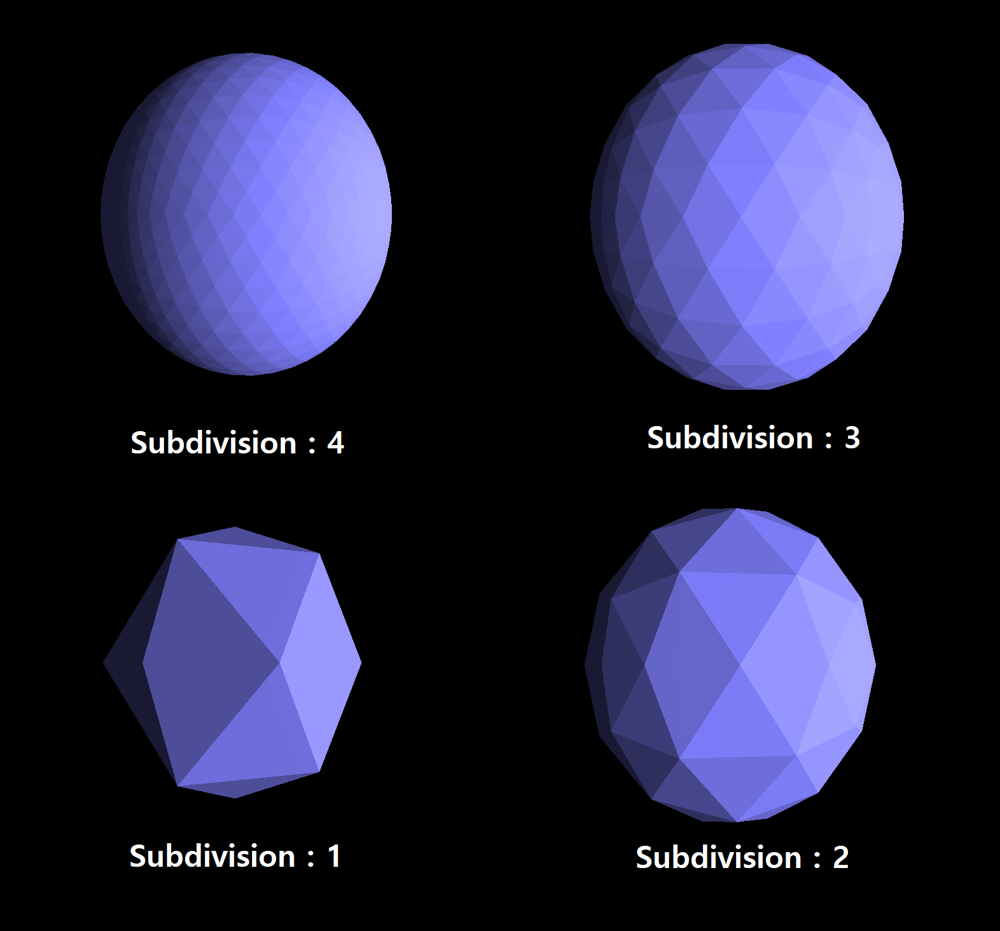
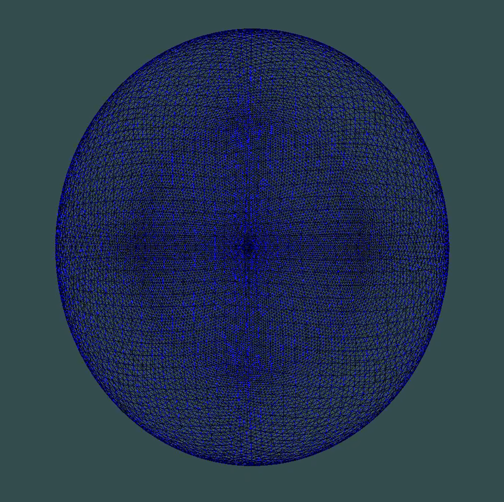

# Icosphere Generator Library

A lightweight C++ library for generating Icosphere meshes.

    
    

# Introduction

The Icosphere Generator provides an efficient way to generate vertices and indices for Icosphere meshes. An Icosphere is a polyhedron made up of equilateral triangle faces. It's often used in 3D graphics due to its even distribution of vertices which is particularly useful for applications like spherical environment mapping.

# Features

- Generate vertices and indices for an Icosphere mesh.
- Define the level of detail with the sample parameter.
- Efficient memory management for vertices and indices storage.

# Installation

To install the Icosphere Generator, simply include the `icosphere_generator.hpp` header in your project.

# Usage:

## Create an Icosphere object with the desired number of samples:
IcosphereGenerator::Icosphere icosphere(2);  // For example: samples = 2

## Generate the mesh:
icosphere.generate();

## Access the vertices and indices:
std::vector<float> vertices = icosphere.vertices;
std::vector<unsigned int> indices = icosphere.indices;

# Contributing:
Pull requests are welcome. For major changes, please open an issue first to discuss what you would like to change. Make sure to update tests as appropriate.

# License:
This project is licensed under the MIT License. For more information, see MIT License.
